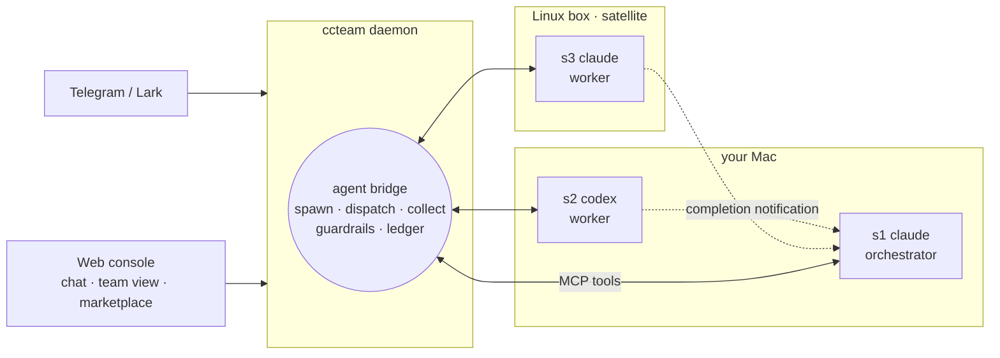

# ccteam

> **Your coding agents, working as one team.**
> Claude Code, Codex, Grok and OpenCode — resident on your machines, hiring each other for work, driven from your phone.

Each agent is strong in a different way: Fable 5 has the deepest reasoning but costs the most; Codex grinds through long jobs without wobbling; Grok is the fastest. Alone, each is one terminal with one context and no colleagues. ccteam bridges them into a team — any session can **spawn** another (any vendor, any machine), **dispatch** work to it, and **collect** the result. How the team is organized is yours: personas are plain Markdown, orchestration patterns are skills you write or install from a marketplace. ccteam provides the bridge underneath — identity, routing, delivery guarantees, guardrails, cost, observability — and never injects a prompt, never scrapes a terminal.

[Install](#install) • [Scenarios](#scenarios) • Manual: [English](docs/usage.md) · [中文](docs/usage-cn.md)

## Architecture



The daemon is a router, not an orchestrator — no scheduler, no tick loop. Agents organize themselves through eight `mcp__ccteam__*` tools; the bridge routes, records, and enforces limits. Sessions have durable ids (`s1`, `s2`, …) that survive restarts and cold-resume from disk. All state is plain files in your own repos.

## Scenarios

**Architect and workers.** Claude Code (Fable 5) is the brain: decomposes the task, sets constraints, owns the verdict — you pay for its depth only where depth matters. Codex takes the long steady grind; Grok takes the quick turnarounds. A foreman persona in between (e.g. `fable-advisor` from the marketplace) separates *how it should be done* from *who does it*. You send one Telegram message; the architect spawns each worker with its first task in a single call, collects, verdicts, replies.

**Cross-model review gate.** Codex implements; before you merge, its parent spawns a Claude session to adversarially review the diff. A different model family catches different bugs.

**Work where the environment is.** The daemon runs on your Mac; the tests need the Linux box with the GPU. Register it once as a satellite — `host: "linux-box"` on a spawn runs the worker there, while transcripts and cost stay on your daemon.

**Steer from your pocket.** Kick off a migration at your desk, close the laptop, redirect the agent mid-task from Telegram on the train.

## The bridge

- **Eight MCP tools.** `session_spawn` (vendor, model, host, persona — and the first task in the same call) · `session_dispatch` (async with completion notification, or wait inline for the answer) · `session_collect` (cursor paging, `tail` for the final answer, honest `working / idle` signal) · `session_list` (delegation tree) · `session_stop` (your own delegates only) · plus `status`, `chat_send_file`, `screenshot`.
- **Delivery you can trust.** At-least-once completion notifications across restarts; idempotency keys so retries never double-run; a child's turn is on disk before its parent is told.
- **Guardrails in the daemon, not in prompts.** Delegation depth, fan-out, per-project ceilings, cycle rejection, daily per-vendor budget caps. Per-session cryptographic identity — no session acts outside its project.
- **Observability.** The team view shows the delegation tree live: who's working, who's stuck, who spent what — plus a dispatch timeline and a cross-host topology.
- **A real API.** Everything the console does is token-authenticated HTTP (`/api/v1`), self-documented at `/api/docs`.

Claude Code is the first-class harness; Codex, Grok and OpenCode run through the same session model best-effort (satellite execution currently supports Claude sessions).

## Install

Fastest: paste one line into an agent you already have (Claude Code, Codex, …):

> Install ccteam: `git clone https://github.com/firstintent/ccteam && cd ccteam && make install`, then run `ccteam status` and give me the web console link.

By hand — from source, or a prebuilt binary:

```bash
git clone https://github.com/firstintent/ccteam && cd ccteam && make install   # Rust + Node
# or
curl -sSL https://raw.githubusercontent.com/firstintent/ccteam/main/install.sh | sh && ccteam start
```

**Configure in the browser** — the console link is printed on start (`http://<lan-ip>:7331/?token=…`). Create a project and just type to launch your first session; Settings → IM pastes a Telegram/Lark bot token (chat id captured automatically); Settings → Hosts registers ccteam's MCP tools into your vendor CLIs with one click and mints join tokens for new machines; the marketplace installs personas and skills, checksum-verified. The CLI equivalents live in the [manual](docs/usage.md).

From chat, the whole team is addressable:

```text
/cd demo                        # pick a project; your next message talks to it
/new codex                      # more sessions: /new [vendor] [role]
@s2 run the test suite          # address any session directly
/status  /sessions  /stop s3    # health · fleet · cost · stop
```

> The console binds to `0.0.0.0:7331` with token auth, no TLS — keep it on a trusted LAN, or use `ccteam start --web-bind 127.0.0.1:7331`.

## Principles

- **No prompt injection** — personas load through the vendor's native mechanism; task text is forwarded verbatim.
- **No terminal scraping** — state comes from transcripts and structured events.
- **Your repo stays yours** — footprint is `.ccteam/`, `.claude/agents/`, and ccteam's own section of `.claude/settings.local.json`; existing `CLAUDE.md`/`AGENTS.md` are never touched.
- **Your data stays local** — `~/.ccteam` and your project directories; no cloud in the loop.
- **Budgets guard, never kill** — daily per-vendor caps are the only automatic brake.

## License

MIT — see [LICENSE](LICENSE). Built on **Claude Code**, with support for **Codex**, **Grok** and **OpenCode**.
