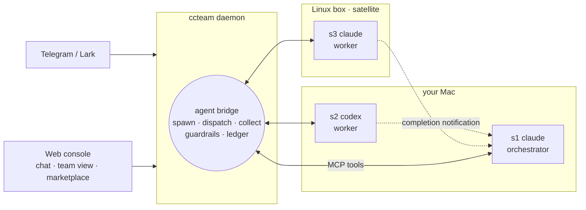

# ccteam

> **Your coding agents, working as one team.**
> Claude Code, Codex, Grok and OpenCode — resident on your machines, hiring each other for work, driven from your phone.

Each agent is strong in a different way: Fable 5 has the deepest reasoning but costs the most; Codex grinds through long jobs without wobbling; Grok is the fastest. Alone, each is one terminal with one context and no colleagues. ccteam bridges them into a team — any session can **spawn** another (any vendor, any machine), **dispatch** work to it, and **collect** the result. How the team is organized is yours: personas are plain Markdown, orchestration patterns are skills you write or install from a marketplace. ccteam provides the bridge underneath — identity, routing, delivery guarantees, guardrails, cost, observability — and never injects a prompt, never scrapes a terminal.

[Install](#install) • [Scenarios](#scenarios) • Manual: [English](docs/usage.md) · [中文](docs/usage-cn.md)

## Architecture



The daemon is a router, not an orchestrator — no scheduler, no tick loop. Agents organize themselves through eight `mcp__ccteam__*` tools: `session_spawn` (vendor, model, host, persona — and the first task in one call), `session_dispatch` (async with completion notification, or wait inline), `session_collect` (cursor paging, `tail` for the final answer, honest `working/idle` signal), `session_list` (delegation tree), `session_stop`, plus `status` / `chat_send_file` / `screenshot`. The bridge routes and records every hop — at-least-once notifications across restarts, idempotency keys, a child's turn on disk before its parent is told — and enforces the limits (delegation depth, fan-out, per-project ceilings, cycle rejection, daily per-vendor budget caps; per-session cryptographic identity, scoped to its own project). Sessions have durable ids (`s1`, `s2`, …) that survive restarts and cold-resume from disk; state is plain files in your repos, live in the console's team view, and scriptable via `/api/v1` (docs at `/api/docs`). Claude Code is the first-class harness; Codex, Grok and OpenCode run through the same session model best-effort (satellite execution currently supports Claude sessions).

## Best practices

For people who already live in Claude Code / Codex — this is the Task tool, except the subagent is a full vendor session that survives you closing the laptop.

**Give the brain a team, keep it roleless.** Run Claude Code (Fable 5) as your orchestrator session and let it read your project's own `CLAUDE.md` — no ccteam persona needed. Install `fable-advisor` (marketplace) or write a skill that teaches it *when* to call `session_spawn` — orchestration lives in prompts you version, not in ccteam config.

**Route by strength, pay for depth once.** Fable 5 decomposes, sets constraints, verdicts. The long steady grind goes to Codex; the quick turnaround goes to Grok:

```text
session_spawn{vendor:"codex", title:"impl", task:"implement RFC-12, run tests, report"}
session_spawn{vendor:"grok",  title:"probe", task:"profile the hot path", wait_seconds:120}
```

Async by default — the completion notification lands in the parent's chat like a colleague reporting back; `wait_seconds` only for sub-minute answers you need inline.

**Gate merges with a rival model.** Codex implements; the parent spawns a Claude reviewer on the diff before you merge. `session_collect{sid, tail:true}` grabs the verdict without paging the whole transcript.

**Run where the environment is.** Tests need the Linux box with the GPU? Register it once as a satellite; `host:"linux-box"` on the spawn runs the worker there — transcripts and cost stay on your daemon.

**Poll like you mean it.** `session_collect` returns `working` while the child is mid-turn and `idle` when the turn is done — don't guess from silence. `session_list` shows the whole delegation tree, and `@s2 …` from Telegram talks to any member directly; you are part of the team, not just its audience.

**Cap the blast radius.** Set delegation depth/fan-out and daily per-vendor budgets in config once; a runaway fan-out is refused by the daemon with a reason, not discovered on the invoice.

## Install

Fastest: paste one line into an agent you already have (Claude Code, Codex, …):

> Install ccteam: `git clone https://github.com/firstintent/ccteam && cd ccteam && make install`, then run `ccteam status` and give me the web console link.

By hand — from source, or a prebuilt binary:

```bash
git clone https://github.com/firstintent/ccteam && cd ccteam && make install   # Rust + Node
# or
curl -sSL https://raw.githubusercontent.com/firstintent/ccteam/main/install.sh | sh && ccteam start
```

**Configure in the browser** — the console link is printed on start (`http://<lan-ip>:7331/?token=…`). Create a project and just type to launch your first session; Settings → IM pastes a Telegram/Lark bot token (chat id captured automatically); Settings → Hosts registers ccteam's MCP tools into your vendor CLIs with one click and mints join tokens for new machines; the marketplace installs personas and skills, checksum-verified. The CLI equivalents live in the [manual](docs/usage.md).

From chat, the whole team is addressable:

```text
/cd demo                        # pick a project; your next message talks to it
/new codex                      # more sessions: /new [vendor] [role]
@s2 run the test suite          # address any session directly
/status  /sessions  /stop s3    # health · fleet · cost · stop
```

> The console binds to `0.0.0.0:7331` with token auth, no TLS — keep it on a trusted LAN, or use `ccteam start --web-bind 127.0.0.1:7331`.

## Principles

- **No prompt injection** — personas load through the vendor's native mechanism; task text is forwarded verbatim.
- **No terminal scraping** — state comes from transcripts and structured events.
- **Your repo stays yours** — footprint is `.ccteam/`, `.claude/agents/`, and ccteam's own section of `.claude/settings.local.json`; existing `CLAUDE.md`/`AGENTS.md` are never touched.
- **Your data stays local** — `~/.ccteam` and your project directories; no cloud in the loop.
- **Budgets guard, never kill** — daily per-vendor caps are the only automatic brake.

## License

MIT — see [LICENSE](LICENSE). Built on **Claude Code**, with support for **Codex**, **Grok** and **OpenCode**.
