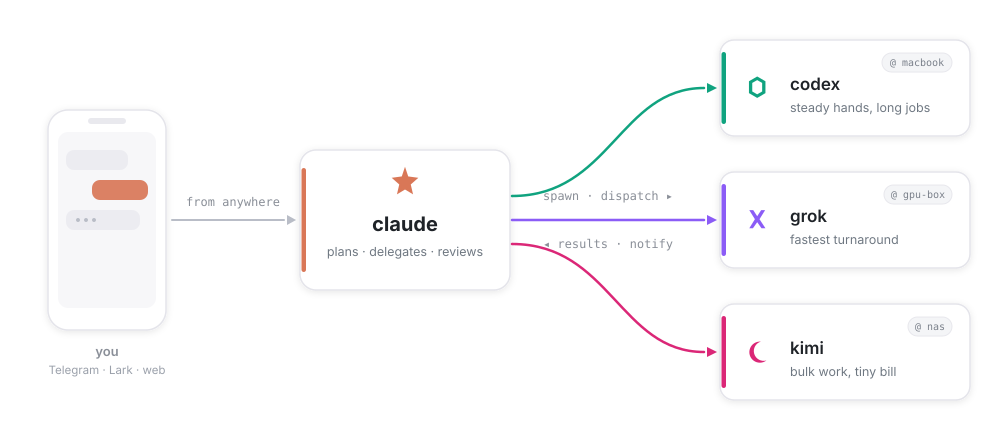

<div align="center">
  
  <h1>ccteam</h1>
  <p><b>ccteam turns the coding agents you already run (Claude Code, Codex, Grok, Kimi…) into one team —<br/>any session can spawn, dispatch, and collect work from any vendor on any machine,<br/>while you steer it all from Telegram, Lark, or a browser tab.</b></p>
  <p>
    <a href="https://github.com/firstintent/ccteam/actions/workflows/check.yml"></a>
    
    
    <a href="LICENSE"></a>
  </p>
</div>

<p align="center">
  
</p>

Each coding CLI is brilliant alone but works in isolation — one terminal, one context, no colleagues:

- **Claude Code** — plans the deepest
- **Codex** — grinds long jobs without wobbling
- **Grok** — answers fastest
- **Kimi** — bulk work on a tiny bill

ccteam is the connective tissue they lack — identity, routing, delivery guarantees, guardrails, a cost ledger — and leaves *how* the team organizes itself to prompts you version.

## Usage

**1 · Remote control from Telegram / Lark**

Paste a bot token once (Settings → IM) and the chat becomes a full console — completion notifications, HITL `[approve] [deny]` buttons, and shipped files all land in the same thread. Dispatch at midnight, close the laptop, find the result at breakfast:

```text
/cd demo                        # pick a project; your next message talks to it
/new codex                      # more sessions: /new [vendor] [role]
@s2 run the test suite          # address any session directly
/status  /sessions  /stop s3    # health · fleet · cost · stop
```

**2 · Remote control from the web console**

The installer runs the daemon; `ccteam status` reprints your link (`http://<lan-ip>:7331/?token=…`) — open it from any device on your LAN. It's a chat shell, not a dashboard:

- quick-start templates aimed at each vendor's strength
- a Chat tab per session (plus a byte-faithful terminal where applicable)
- the live delegation tree
- a cost pill with daily budget caps
- marketplace and settings

Everything the console does is also `/api/v1` (OpenAPI at `/api/docs`).

**3 · Orchestrate a team from inside a claude session**

Any registered session can hire the others — say it in plain language and `session_spawn` / `dispatch` / `collect` run under the hood (with an honest `working` / `idle` signal, so nobody guesses from silence):

```text
Spawn a codex session, have it implement RFC-12 and run the tests; report back when green.

Plan this refactor, then delegate: codex implements, grok profiles the hot path in
parallel, kimi sweeps the rename across the repo. Collect everything into one summary.

Spawn a claude reviewer on s2's diff — I'm not merging until it signs off.
```

**4 · Many machines, one console**

Register a satellite with a join token (Settings → Hosts) — it dials out to your daemon, so a laptop behind NAT works fine. Projects are bound to a host and run where they live: spawn into the GPU-box project and its tests run on the GPU box, while transcripts, cost, and the team view stay in one console. Switching machines is just switching projects.

> Satellite execution currently runs Claude sessions; the other vendors run on the daemon's machine.

---

Under all four modes are the same **eight MCP tools**, available to every session (and to your plain hand-started CLIs once registered):

```text
session_spawn · session_dispatch · session_collect · session_list · session_stop
status · chat_send_file · screenshot
```

The daemon routes and records — at-least-once notifications across restarts, idempotency keys, a child's turn written to disk before its parent is told, guardrails that refuse runaway fan-out with a reason. It never schedules; *when* to delegate lives in prompts you version.

- Plain-language walkthrough → [orchestration guide](docs/orchestration.md)
- Every command → manual ([English](docs/usage.md) · [中文](docs/usage-cn.md))

## Install

**1 · Let an agent do it** — paste into any agent you already have:

> Install https://github.com/firstintent/ccteam — follow `INSTALL.md` in the repo.

**2 · From source** (Rust + Node):

```bash
git clone https://github.com/firstintent/ccteam && cd ccteam && make install
```

**3 · One-click script** (prebuilt binary, no toolchain):

```bash
curl -sSL https://raw.githubusercontent.com/firstintent/ccteam/main/install.sh | sh
```

One static binary into `~/.local/bin`, no sudo. Then:

- `ccteam daemon start` — run the daemon in the background; prints your web console link (`http://<lan-ip>:7331/?token=…`)
- `ccteam config` — register the MCP tools into your vendor CLIs (Claude Code, Codex, Grok, OpenCode, Kimi), so even hand-started sessions can hire the team

**Configure in the browser** — create a project and just type; the session is born on your first message. Then:

- **Settings → IM** — paste a Telegram/Lark bot token (chat id captured automatically)
- **Settings → Hosts** — register MCP into your CLIs; mint join tokens for new machines
- **Marketplace** — install personas and skills, checksum-verified

> The console binds to `0.0.0.0:7331` with token auth, no TLS — keep it on a trusted LAN, or use `ccteam start --web-bind 127.0.0.1:7331`.

## Daemon

The daemon is self-managed — one mechanism on Linux, macOS, and WSL (no systemd or launchd to wire up). All verbs take `--json` for scripting.

```bash
ccteam daemon start          # background (setsid; survives your shell closing) + prints the web link
ccteam daemon status         # pid · ready · running-vs-installed version
ccteam daemon restart        # graceful stop + restart onto the current binary
ccteam daemon stop           # graceful stop; sessions resume by id on next start
ccteam daemon logs -f        # follow ~/.ccteam/daemon.log
```

- **No boot-autostart or crash-restart** — after a reboot, run `ccteam daemon start` again (`ccteam status` / `ccteam doctor` show a down daemon at a glance; a `@reboot ccteam daemon start` cron line covers boot-start if you want it).
- `ccteam start` still runs in the **foreground** — for dev, containers, or your own supervisor's `ExecStart`.
- **Upgrading from a pre-v0.9.7 install?** systemd/launchd are retired; the first `ccteam daemon start` (or `install.sh`) auto-migrates the old unit and takes over — a unit you wrote by hand is left untouched.

## Chaining sessions

Delegation is explicit — an agent (or you) says who does what, and the bridge handles identity, routing, delivery, and the ledger:

```text
session_spawn{vendor:"codex", title:"impl",  task:"implement RFC-12, run tests, report"}
session_spawn{vendor:"grok",  title:"probe", task:"profile the hot path", wait_seconds:120}
session_spawn{vendor:"kimi",  title:"chore", task:"apply the rename across every module"}
```

Async by default: the completion notification lands in the parent's chat like a colleague reporting back. `wait_seconds` is for sub-minute answers you need inline.

**Common workflows:**

- **Plan → build → gate** — claude decomposes and sets constraints; codex implements; a rival model reviews the diff before you merge.
- **Grind + probe** — codex holds the long job while grok answers the quick question before codex finishes a step.
- **Bulk on a budget** — fan the repetitive 80% out to kimi; keep the judgment calls on claude.

Who gets what starts from facts, not guesses: one `status` call is the roster — vendors installed, authenticated, and in-budget on the project's host, an advisory model catalog, and your routing notes (`<project>/.ccteam/routing.md` over the global fallback). Omit `model` and each spawn rides the vendor's default.

## Project context

ccteam adds a team to your repo without taking it over:

- **Roleless by default** — the brain reads *your* `CLAUDE.md` / `AGENTS.md` through the vendor's own mechanism; ccteam never rewrites project knowledge.
- **Small footprint** — exactly `.ccteam/` (state), `.claude/agents/` (personas you install), and ccteam's own section of `.claude/settings.local.json` — never your `settings.json`.
- **Durable sessions** — ids (`s1`, `s2`, …) survive daemon restarts and cold-resume from disk; state is plain files in your repo.

## Extras

- **Marketplace** — personas and skills install from [ccteam-hub](https://github.com/firstintent/ccteam-hub) into your project's `.claude/`: fetched from pinned upstreams, sha256-verified, copied verbatim, never executed. Vendor-native Claude Code plugins are delegated to Claude Code itself (ccteam only flips the two settings keys).
- **HITL approvals** — spawn a session in approval mode and its permission requests reach your IM as `[approve] [deny]` buttons, through the vendor's native gate; deny blocks the tool call without killing the turn.

## Why

Five excellent coding CLIs shipped in two years, and each assumes it's alone. The result: you, alt-tabbing between vendors, re-pasting context, playing message bus. The fix isn't a framework on top — the vendors' harnesses are already great. It's the connective tissue they lack: identity, routing, delivery, cost, observability, across vendors and machines. That's ccteam — `cc` for the Claude Code it grew out of, `team` for what your agents become.

It stays deliberately underneath:

- **No prompt injection** — personas load through the vendor's native mechanism; task text is forwarded verbatim.
- **No terminal scraping** — state comes from transcripts and structured events.
- **Local first** — `~/.ccteam` and your repos; no cloud in the loop.
- **Budgets guard, never kill** — daily per-vendor caps are the only automatic brake.

## Update

```bash
ccteam update                # update in place; restarts the daemon onto the new binary
```

`ccteam status` shows your version and flags a newer release. (Details: [usage](docs/usage.md#updating).)

## Uninstall

```bash
curl -sSL https://raw.githubusercontent.com/firstintent/ccteam/main/install.sh | sh -s -- --uninstall
rm -rf ~/.ccteam        # state, secrets, hub cache — keep it if you may return
```

Per project, delete `.ccteam/` and ccteam's section of `.claude/settings.local.json`.

## Support

- Questions, bugs, ideas → [issues](https://github.com/firstintent/ccteam/issues); PRs welcome.
- If the team saved you an alt-tab, a star keeps the juggler juggling.

## License

MIT — see [LICENSE](LICENSE). Built on **Claude Code**, driving **Codex**, **Grok**, **OpenCode** and **Kimi**.
