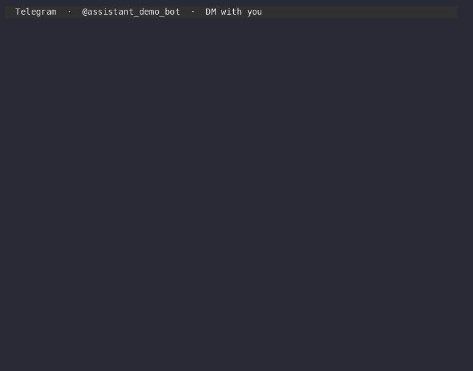

# ccteam

> **A multi-agent orchestrator on top of Claude Code** — one tool, three tiers: in-proc temporary helpers / bg long-running workflows / IM bots running 24/7.



## Three runtime modes (the core of ccteam)

ccteam adds **three multi-agent runtime modes** to Claude Code, each for a different cadence:

| # | Mode | How it's hosted | Typical use |
|---|---|---|---|
| **1** | **Lightweight (in-proc)** | Inside an existing Claude session; ccteam acts as a plugin/skill that spawns temporary teammates via the native `Task` tool, sharing the session lifecycle | Summoning helpers while coding / a quick 3–5 agent burst |
| **2** | **bg workflow orchestration** | Multiple `claude --bg --agent <role>` sessions collaborating through a `workflow.yaml` of triggers; file artifacts pass the baton; the ccteam Rust daemon runs long while bg jobs come and go | Power users running long workflows in a domain (qa-loop: test-fix-release / self-driving builds) |
| **3** | **IM bots (tmux-resident)** | Long-running tmux + `claude` TUI sessions, one per agent bot, always on; bots talk to each other in an IM group by @-mentioning | Chatting privately with an AI assistant on your phone / a multi-bot team collaborating across devices in an IM group |

The three modes are fixed at the bottom; **the application layer on top is open** — the five presets below ship as a starter set, and the `ccteam-creator` skill can generate new scenarios from a natural-language description.

## 5-minute quickstart (pick an entry point by mode)

```bash
# 0. Install Claude Code + the ccteam plugin first.
# https://code.claude.com/docs/install
claude
/plugin install ccteam

# === Mode 1: summon a temporary helper inside an existing session ===
/ccteam "clean up all the TypeScript errors here"
# Or burst a few agents in parallel:
/ccteam-team 3 "refactor the src/auth submodule"

# === Mode 2: kick off a bg long-running workflow ===
/ccteam-creator "overnight qa-loop: run tests on every commit, auto-fix on failure"

# === Mode 3: hook up IM bots ===
/ccteam-im-setup                            # one-time bind for TG/Slack/Discord
/ccteam-creator "build me a TG DM assistant that helps manage my email"
```

→ See [quickstart](docs/quickstart.md) for the full walkthrough.

## 5 presets, pick whichever fits

Each preset is a recommended "mode × orchestration pattern × persona" recipe; `ccteam-creator` wires it up through NL dialogue:

| Preset | One-line scenario | How to launch | Mode |
|---|---|---|---|
| **Solo Sidekick** | Summon a single helper while coding with Claude | `/ccteam <natural language>` | 1 |
| **Team Sprint** | A few-hour burst with 3–5 agents in parallel | `/ccteam-team 3 "<task>"` | 1 |
| **Overnight Builder** | Drop a task and go to sleep; runs for hours to days | `/ccteam-creator "overnight ..."` | 2 |
| **Pocket Assistant** ⭐ | A private AI assistant in your phone IM | `/ccteam-creator "build a TG assistant"` | 3 |
| **IM Squad** ⭐ | Multiple bots in an IM group @-mentioning each other | `/ccteam-creator "build a multi-bot TG team"` | 3 |

⭐ flagship scenarios. Mode 3 brings your AI team into IM, working on your behalf across devices 24/7 — the difference vs. ChatGPT / Cursor / Devin: the bots run **on your computer**, can touch your files, run your commands, read your code; your phone is just the entry point.

## Three ways to talk to ccteam

- 🟢 **Inside a Claude session**: `/ccteam <natural language>` is the universal entry point (works for modes 1/2/3)
- 🟢 **From IM** (mode 3): DM a bot, or `@ccteam <NL admin>` in a group
- 🟡 **Web dashboard** (modes 2/3): `http://localhost:7331` (read-only)

> You **do not** need to learn CLI commands, and you **do not** need to write any YAML. All setup happens through dialogue inside a Claude session.

## Docs

| What you want | Read this |
|---|---|
| Get the first preset running in 5 minutes | [docs/quickstart.md](docs/quickstart.md) |
| Full 3-mode + 5-preset user manual | [docs/user-manual.md](docs/user-manual.md) |
| Copy-paste a ready-made use case | [docs/recipes.md](docs/recipes.md) |
| Something broke and you cannot find it | [docs/troubleshooting.md](docs/troubleshooting.md) |
| Advanced customization / Codex integration | [docs/advanced/](docs/advanced/) |

## License & acknowledgements

See [LICENSE](LICENSE). Built on [Claude Code](https://code.claude.com/) (the runtime) and [openhuman/channels](https://github.com/openhuman/channels) (14+ IM platforms in Rust); orchestration taxonomy from Anthropic's *Building Effective Agents*; mode-3 IM bot pattern (tmux + send-keys + transcript polling) inspired by `ccgram` and `oh-my-claudecode`.

---

See [docs/versions/v0-6-1/README.md](docs/versions/v0-6-1/README.md) for current release notes.
