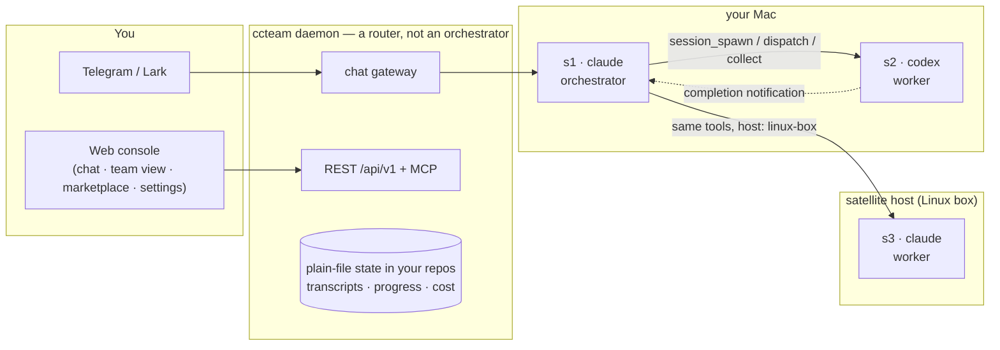

# ccteam

> **Your coding agents, working as one team.**
> Claude Code, Codex, Grok and OpenCode — resident on your machines, hiring each other for work, driven from your phone.

Every coding-agent CLI is brilliant and alone: one terminal, one context, one lifetime, no colleagues. ccteam is the layer that turns them into a **team**. A resident daemon keeps agent sessions alive around the clock; any session can **spawn** another session — same vendor or a different one, same machine or another one — **dispatch** work to it, and **collect** the result. A Claude architect can hire Codex workers. A Grok session can ask Claude to review its diff. You watch and steer the whole thing from Telegram, Lark, or a web console.

ccteam deliberately does **not** decide how your team is organized. Personas are plain Markdown files your vendor CLI loads natively; orchestration patterns are skills and prompts you write or install from a marketplace. ccteam provides the substrate underneath — identity, routing, delivery guarantees, guardrails, cost, approvals, observability — and never injects a prompt, never scrapes a terminal, never forks a vendor runtime.

[Quick start](#quick-start-web-first) • [What a team looks like](#what-a-team-looks-like) • User manual: [English](docs/usage.md) · [中文](docs/usage-cn.md)

## How it fits together



The daemon is the whole control plane: IM gateway, web console, HTTP API, MCP endpoint. There is **no scheduler and no tick loop** — agents call eight `mcp__ccteam__*` tools to organize themselves, and the daemon routes, records, and enforces limits. Sessions are first-class entities with durable ids (`s1`, `s2`, …) that survive daemon restarts; stopped sessions cold-resume from disk with their conversation intact. All state lives in plain files inside your own repos.

## What a team looks like

**Architect and workers.** Claude Code (say, Fable 5) is the orchestrator: it decomposes the task, sets constraints, spawns workers, and owns the final verdict. Codex (a GPT codex model) and Grok CLI are the hands: they run commands, edit files, and report back. A foreman persona in between — e.g. the `fable-advisor` recipe from the marketplace — separates *how it should be done* from *who does it*. You send one Telegram message; the architect spawns the workers with their first task in a single call, they work in parallel, completion notifications flow back, the architect reviews and replies to you with the verdict — and every hop is visible in the web console's team view.

**Cross-model review gate.** Codex implements a feature; before you merge, its parent spawns a Claude session that adversarially reviews the diff. A different model family catches different bugs — you get a built-in second opinion without leaving chat.

**Work where the environment is.** Your daemon runs on a Mac, but the integration tests need the Linux box with the GPU. Register that box as a satellite host once; now `host: "linux-box"` on a spawn runs the worker there, while transcripts, cost accounting, and approvals stay on your main daemon.

**Long jobs from your pocket.** Kick off a migration at your desk, close the laptop. Steer mid-task from your phone, answer the agent's questions, and approve risky commands with tap-buttons (human-in-the-loop mode holds non-allowlisted tool calls for your approve/deny — a deny blocks that one call, never the whole turn).

How the team organizes is entirely yours: personas live in your project's `.claude/agents/`, orchestration know-how lives in skills — install curated ones from [ccteam-hub](https://github.com/firstintent/ccteam-hub) (sha256-pinned, verbatim copies) or write your own. Remove ccteam and your repo still works.

## The substrate

What ccteam actually provides under your team:

- **Agent-to-agent calls.** Eight MCP tools; any authenticated session can use them, scoped to its own project. `session_spawn` starts a helper (vendor, model, effort, host, persona, HITL posture — and optionally its first task in the same call); `session_dispatch` sends a task and either returns immediately (completion notification arrives later as a normal message) or waits inline for the answer; `session_collect` pages the transcript with cursors, `tail` for the final answer, and an honest `working / idle` activity signal; `session_list` returns the delegation tree; `session_stop` stops only sessions you delegated.
- **Delivery you can trust.** Completion notifications are at-least-once across daemon restarts; spawns and dispatches take idempotency keys so client retries never double-run; a child's turn is durably on disk before its parent is notified.
- **Guardrails, enforced by the daemon — not by prompts.** Delegation depth, per-parent fan-out, per-project ceilings, cycle rejection, and daily per-vendor budget caps. Each session gets its own cryptographic identity; a session can never act outside its project or forge who's calling.
- **Observability.** The web team view shows the delegation tree as a roster (who's working, who's stuck, who spent what), a 30-minute dispatch timeline, and a cross-host topology graph — live. Per-session cost everywhere.
- **A real API.** Everything the console does is a token-authenticated HTTP API (`/api/v1`), self-documented at `/api/docs`.

Claude Code is the first-class harness; Codex, Grok and OpenCode run through the same session model best-effort (remote execution on satellites currently supports Claude sessions). ccteam launches the real vendor binaries from your `PATH` — a new vendor feature works the day it ships.

## Quick start (web-first)

Prerequisite: at least one vendor CLI installed and logged in on the machine ([Claude Code](https://code.claude.com/docs/install) recommended).

```bash
curl -sSL https://raw.githubusercontent.com/firstintent/ccteam/main/install.sh | sh
ccteam start        # prints your console link: http://<lan-ip>:7331/?token=ccteam:<token>
```

Open the console link — everything else is point-and-click:

- **Start working:** pick or create a project on the home screen, type a message — that's your first session.
- **Connect your phone:** Settings → IM — paste a Telegram bot token (or Lark credentials); the page captures your chat id automatically.
- **Give agents their tools:** Settings → Hosts — one click registers ccteam's MCP tools into your vendor CLIs.
- **Install personas & skills:** the built-in marketplace installs orchestrator recipes (e.g. `fable-advisor`, `team-brain`), roles and skills into your project, pinned and checksum-verified.
- **Add machines:** Settings → Hosts — generate a join token and paste one command on the other machine; a machine already running ccteam becomes a satellite automatically.

Prefer the terminal? `ccteam config` is the CLI setup hub, and the full command surface (projects, sessions, hosts, doctor) is in the [user manual](docs/usage.md).

From chat, the whole team is addressable:

```text
/cd demo                        # pick a project; your next message talks to it
/new codex                      # more sessions: /new [vendor] [role] [hitl]
@s2 run the test suite          # address any session directly
/status  /sessions  /stop s3    # health · fleet · cost · stop
```

> **Security note:** the web console binds to `0.0.0.0:7331` with token auth and no TLS — keep it on a trusted LAN. For local-only use: `ccteam start --web-bind 127.0.0.1:7331`.

## Principles

- **No prompt injection.** Personas are plain `.md` files the vendor CLI loads through its native mechanism; a roleless session is the bare CLI reading your project's own `CLAUDE.md`. ccteam never writes a system prompt into a session, and task text is forwarded verbatim.
- **No terminal scraping.** State comes from transcripts and structured vendor events, never from parsing screen output.
- **Your repo stays yours.** ccteam never edits your product code or an existing `CLAUDE.md`/`AGENTS.md`; its entire per-project footprint is `.ccteam/`, `.claude/agents/`, and its own section of `.claude/settings.local.json`.
- **Your data stays on your machines.** Everything is local files under `~/.ccteam` and your project directories — no cloud service in the loop.
- **Pure CLI, not a vendor plugin.** ccteam registers MCP tools and otherwise stays out of the vendor's runtime; no vendor binary is bundled or forked.
- **Budgets guard, never kill.** Daily per-vendor cost caps are the only automatic brake; outside that, ccteam never kills a long-running session on its own.

## License

MIT — see [LICENSE](LICENSE). Built on **Claude Code**, with support for **Codex**, **Grok** and **OpenCode**.
